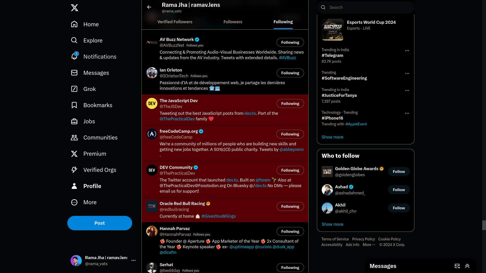

**Highlight Non-Followers User Script**

**Overview**
================

This user script is designed to highlight non-followers in your X profile by modifying their background color. It uses a combination of CSS selectors and the MutationObserver API to dynamically identify non-followers as they load onto the page.

**Requirements**
---------------

* This script requires a Tampermonkey or similar userscript manager.
* It assumes you are using X's web interface at `https://x.com/`.
* You must replace `"https://x.com/rama_vats/following"` with your actual username in the script code.

**Installation and Usage**
---------------------------

1. Install Tampermonkey from the [Chrome Web Store](https://chromewebstore.google.com/detail/tampermonkey/dhdgffkkebhmkfjojejmpbldmpobfkfo) or [Firefox Addons](https://addons.mozilla.org/en-US/firefox/addon/tampermonkey/).
2. Create a new userscript by clicking the "Create a new script" button within Tampermonkey.
3. Replace the placeholder `// @name` directive with `"Highlight Non-Followers"` (or any other name of your choice).
4. Paste the contents of this code into the editor.
5. Save and refresh your X Following page to see non-followers highlighted.

**How It Works**
-----------------

1. When you navigate to your X following page, the script initializes after a 2-second delay to ensure the page has fully loaded.
2. The script uses CSS selectors to identify all div elements with the `data-testid="cellInnerDiv"` attribute.
3. For each identified element, it checks if the user is not followed (i.e., no follow indicator exists). If so, it sets the background color of that element to a dark red (`#64181c`).
4. The script then sets up two MutationObserver instances:
	* One observes changes in the DOM and re-runs the highlighting function every 2 seconds if on the correct page.
	* Another monitors for URL changes and disables the script when you navigate away from your following page.